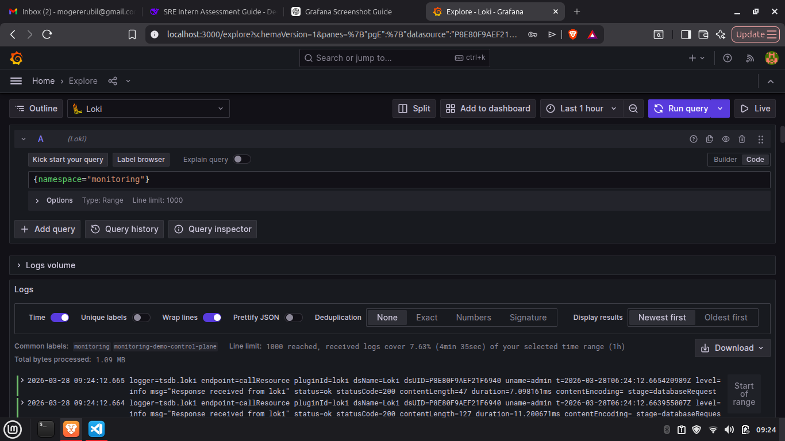
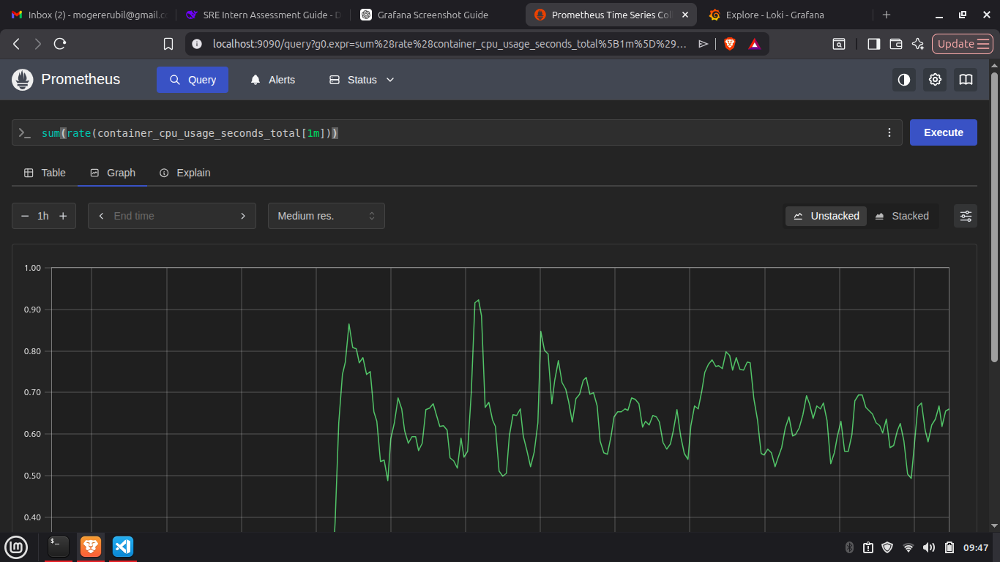

# Test 1 – Monitoring Stack

## Tool Selection

**Logging**: Promtail + Loki + Grafana  
**Metrics**: Prometheus + Grafana  

### Why these tools?

- **Loki** is lightweight, cost-effective, and tightly integrated with Grafana. It uses labels from Kubernetes, making it easy to correlate logs with metrics.
- **Promtail** is a simple agent that runs as a DaemonSet and ships logs to Loki with minimal overhead.
- **Prometheus** is the industry standard for Kubernetes metrics, with a powerful query language (PromQL) and a rich ecosystem.
- **Grafana** provides a single pane of glass for both logs and metrics, simplifying observability.

### Alternative Considered

I also considered the EFK stack (Elasticsearch, Fluentd, Kibana). While it offers more powerful full-text search, it requires more resources and operational complexity. For a small team starting out, Loki is simpler to maintain.

## Setup Environment

I used a local Kubernetes cluster created with **kind** (Kubernetes in Docker). This simulates an AKS environment without requiring Azure credits. The stack is deployed using **Helm** charts for reproducibility.

## Deployment Steps

1. Install kind and kubectl.
2. Create a cluster: `kind create cluster --name monitoring-demo`
3. Install Helm: `curl https://raw.githubusercontent.com/helm/helm/main/scripts/get-helm-3 | bash`
4. Add repositories:
   ```bash
   helm repo add grafana https://grafana.github.io/helm-charts
   helm repo add prometheus-community https://prometheus-community.github.io/helm-charts
   helm repo update
   ```
5. Deploy Loki stack (includes Promtail and Grafana):
   ```bash
   helm install loki grafana/loki-stack \
     --set grafana.enabled=true \
     --set promtail.enabled=true \
     --set loki.persistence.enabled=false
   ```
   (For production, enable persistence.)
6. Deploy Prometheus:
   ```bash
   helm install prometheus prometheus-community/kube-prometheus-stack \
     --set grafana.enabled=false \
     --set prometheus.prometheusSpec.serviceMonitorSelectorNilUsesHelmValues=false
   ```
   (Disable the bundled Grafana since we already have one.)
7. Expose Grafana service:
   ```bash
   kubectl port-forward service/loki-grafana 3000:80
   ```
   Access Grafana at http://localhost:3000 (admin/prom-operator by default – change password in production).
8. Add Prometheus as a data source in Grafana: URL `http://prometheus-kube-prometheus-prometheus:9090`.
9. Loki is already added automatically by the Loki stack chart.

## Verification

**Logs**  


**Metrics**  


## Dashboards

I created a custom dashboard combining key metrics and logs. The exported JSON is in `dashboards/dashboard.json`. It includes:
- Pod CPU and memory usage
- Node metrics
- A log panel filtered by namespace and pod
- Alerts for high CPU or pods in CrashLoopBackOff

## Alerts

Alert rules are defined in `alerts/alert-rules.yaml`. They are configured in Prometheus via the `kube-prometheus-stack` values. The alerts include:
- **High CPU usage** (pod > 80% for 5 minutes)
- **Pod restarts** (> 5 restarts in 10 minutes)
- **Missing application logs** (no logs for 10 minutes)

## Why This Stack is Suitable for AKS

The same Helm charts work on AKS with minor adjustments (e.g., using Azure managed disks for persistence). The tooling is cloud-agnostic, so the team can later move to another cloud without rewriting monitoring.
